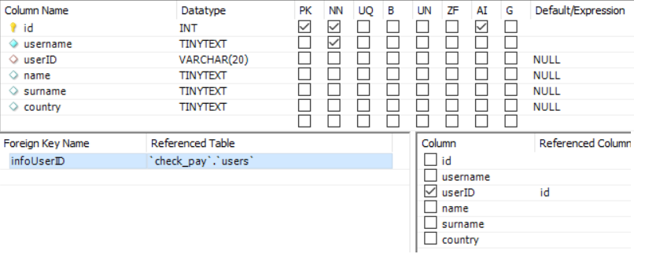
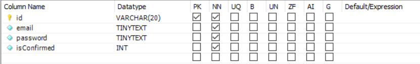
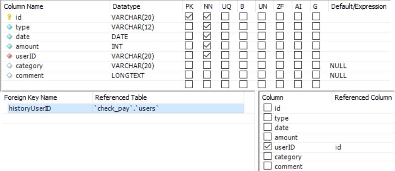

# CheckPay
CheckPay is an educational project aimed at studying the popular React, Express frameworks and applying knowledge when working with a MySQL database.
This service helps users analyze their expenses and adjust the budget based on this data.

## Main Features
+ User registration with confirmation by email
+ Adding all expenses and income to the database
+ Displaying statistics and graphs
+ Nice interface

## Requirements:
The following must be installed on the device:
+ NodeJS

## Assigning project files and directories:
+ `client/public` - frontend public files
+ `client/src` - frontend React sources
+ `config`- backend configuration files
+ `layouts` - HTML layouts
+ `mail` - backend working with email
+ `middleware` - backend middleware functions
+ `routes` - backend routing
+ `app.js` - backend main file
+ `db.js` - backend work with MySQL DB
+ `package.json` - Backend list of dependencies and basic information

#### Questions? Comments? Suggestions?
I'm ready to explore any additions)

# CheckPay - Installation

To upload this project to yourself, you can use one of the following methods:
+ ```` git clone https://github.com/Keberson/checkpay.git ````
+ Download from [here](https://github.com/Keberson/checkpay/archive/refs/heads/fullstack.zip)

After downloading and unpacking, you need to install the frontend and backend libraries by following these steps:
```` 
cd fullstack
npm i
cd client
npm i
````
In the configuration file, you must specify the backend port (frontend is started by default at 3000), host, password and MySQL database schema, as well as, if necessary, change the name of the tables. The database should have the following tables:
+ user_information

+ users

+ users_history

+ users_message


Hooray, the project is ready to launch! Write the following command to run the frontend and backend parts:
```` 
npm run dev 
````

# CheckPay Main Page

On the main page, the user can go to registration or authorization, get acquainted with the list of our advantages and send a message to the developers.


# CheckPay Authorization and Registration

To register, the user must enter an email, username and password. Email is required for password recovery. That is why, after registration, the user receives an email with a confirmation link.


When logging in, the user specifies only the email and password. 

If the password has been forgotten, it can be restored by going to the appropriate section and entering your Email. A link with a new temporary password will be sent to it.


If the user has not had time to confirm his email, then he receives a temporary password in the notification.


# CheckPay LK

## LK Home
In the personal account, the user can add expenses, income and set a limit, view the history, as well as graphs and statistics by period, change personal data.

The main page displays all the main widgets: User Information, Statistics with one of the graphs, Adding expenses and History.


## LK Add
On the add page, the user can use the corresponding widget and view the history.


The user can set one of the following types:
+ Income 
+ Expenditure 
+ Planned

For Expenditure, it is possible to select a category and set a specific date, for the rest, you can set the month and year.
Planned is the setting of a limit for a certain month.


## LK Statistics

The user can set up a time interval, view statistics for it in general and by specific categories, a limit for a month, as well as several graphs:
+ general graph for all time
+ graph by category for the given period
+ monthly expense graph


## LK History

On this page, the user can view the entire history and delete the necessary lines.


## LK Settings

The user can add his first and last name, country of residence, change password or email.
